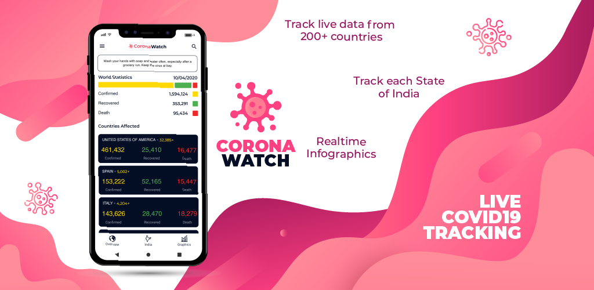
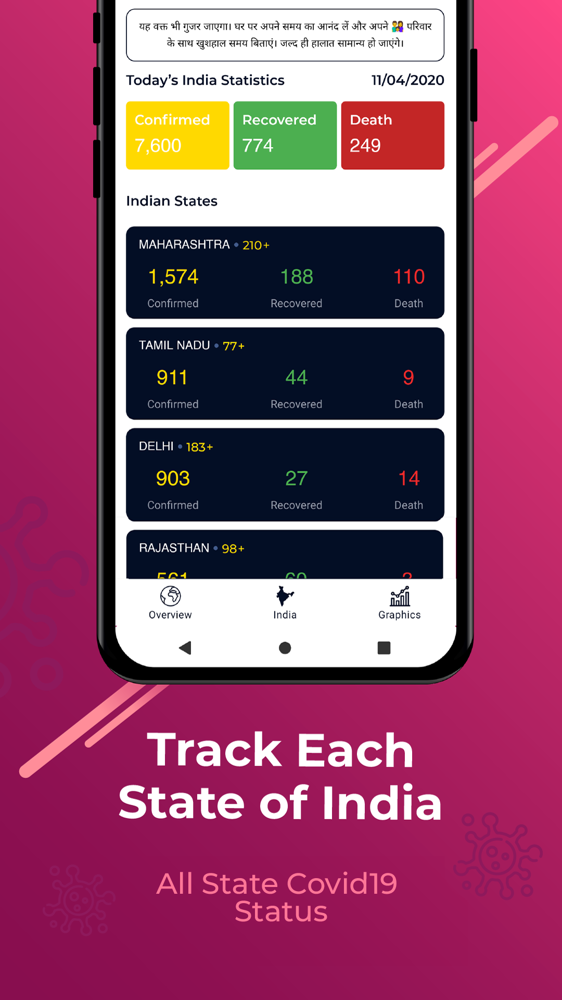

# Corona Tacker

Corona Watch is unofficial application to provide live world wide and indian corona statistics

### API Used in this project

https://api.covid19india.org/ (State wide data)
https://api.covid19api.com/ (Worldwide data)

### Databse

Room database used in this application 

### Screenshots
   

## Authors

* **Altaf Chaduahri** - *Initial work* - [Altaf Chadhari](https://github.com/altafc22)

## License

This project is licensed under the MIT License - see the [LICENSE.md](LICENSE.md) file for details

## Acknowledgments

* Hat tip to anyone whose code was used
* Inspiration
* etc
